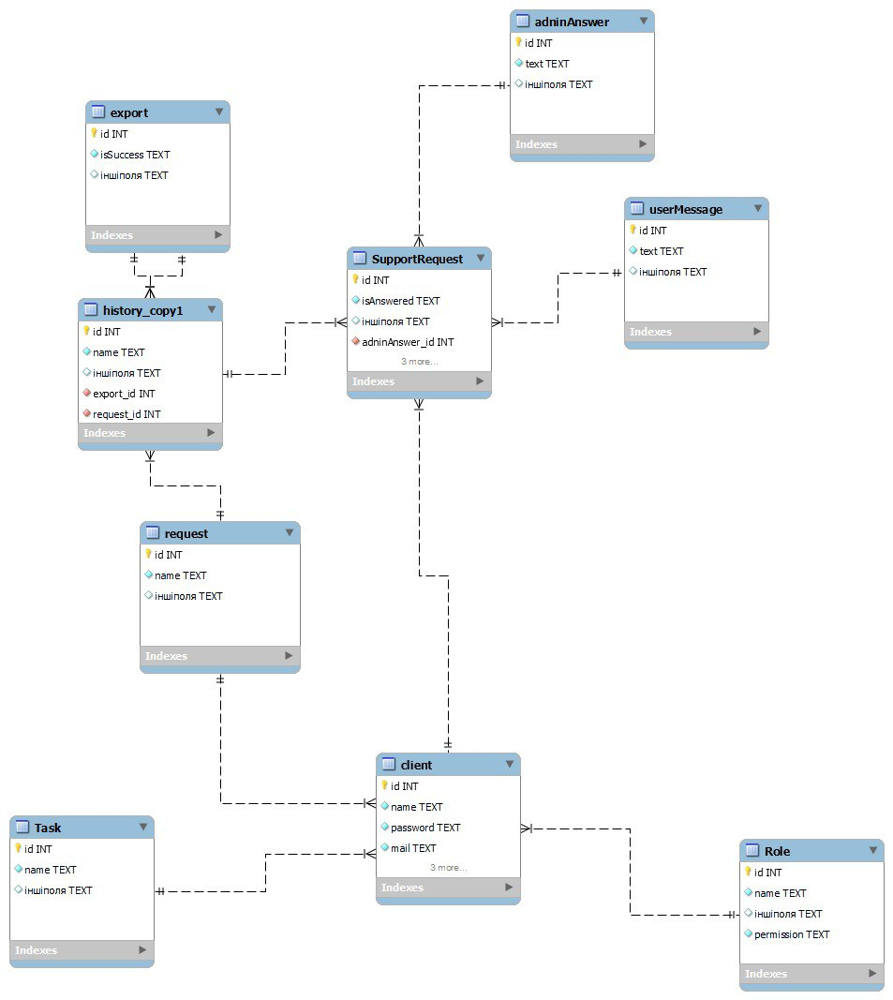

# Проєктування бази даних

В рамках проекту розробляється: 
- модель бізнес-об'єктів 
- ER-модель
- реляційна схема

## Модель бізнес-об'єктів

@startuml

entity Client
entity Client.id
entity Client.name
entity Client.mail
entity Client.password

Client.id -u-* Client
Client.name -u-* Client
Client.mail -u-* Client
Client.password -u-* Client

entity Role
entity Role.id
entity Role.name
entity Role.permission
entity Role.description

Role.id -l-* Role
Role.name -u-* Role
Role.permission --* Role
Role.description --* Role

Role "1,1"-l--"0,*" Client

entity Task
entity Task.id
entity Task.name
entity Task.deadline

Task.id --* Task
Task.name -r-* Task
Task.deadline --* Task

Task "0,*"-r--"1,1" Client

entity Request
entity Request.id
entity Request.name
entity Request.time
entity Request.description

Request.id --* Request
Request.name --* Request
Request.time --* Request
Request.description -r-* Request

Request "0,*"---"1,1" Client

entity History
entity History.id
entity History.name
entity History.time

History.id --* History
History.name --* History
History.time -r-* History

History "1,1"---"0,*" Request

entity SupportRequest
entity SupportRequest.id
entity SupportRequest.isAnswered
entity SupportRequest.type

SupportRequest.id --* SupportRequest
SupportRequest.isAnswered --* SupportRequest
SupportRequest.type --* SupportRequest

SupportRequest "0,*"-r--"1,1" Client
SupportRequest "0,*"-l--"1,1" History

entity userMessage
entity userMessage.id
entity userMessage.text
entity userMessage.time

userMessage.id --* userMessage
userMessage.text --* userMessage
userMessage.time -l-* userMessage

userMessage "1,1"-l--"1,1" SupportRequest

entity adminAnswer
entity adminAnswer.id
entity adminAnswer.text
entity adminAnswer.time

adminAnswer.id --* adminAnswer
adminAnswer.text --* adminAnswer
adminAnswer.time --* adminAnswer

adminAnswer "1,1"---"1,1" SupportRequest

entity Export
entity Export.id
entity Export.isSuccess
entity Export.time

Export.id --* Export
Export.isSuccess --* Export
Export.time --* Export

Export "0,*"---"1,1" History

@enduml
## ER-модель
@startuml
namespace HistoryManagement {  
    entity Export <<ENTITY>>{ 
        +Export.id: int
        --
        Export.isSuccess:bool
        Export.time:datetime
    }
   
    entity History <<ENTITY>> {
        +History.id:int
        --
        History.name:string
        History.time:datetime
    }
}
namespace SupportManagement {   
    entity SupportRequest <<ENTITY>> {
        +SupportRequest.id:int
        --
        SupportRequest.isAnswered:bool
        SupportRequest.type:string
    }
    
    entity adminAnswer <<ENTITY>> {
        +adminAnswer.id:int
        --
        adminAnswer.text:string
        adminAnswer.time:datetime
    }
    
    entity userMessage <<ENTITY>>{ 
        +userMessage.id:int
        --
        userMessage.text:string
        userMessage.time:datetime
    }
}
namespace TaskManagement {
    entity "Task" as task <<ENTITY>>{
        +id: int
        --
        name: string
        deadline: datatime
        }
}
namespace AccesControl {        
    entity "Client" as client <<ENTITY>>{
        +id: int
        --
        name: string
        name: string
        mail: string
        password: string
        }
        
    entity "Role" as role <<ENTITY>>{
        +id: int
        --
        name: string
        permission: string
        description: string
        }
    entity "Request" as request <<ENTITY>>{
        +id: int
        --
        name: string
        time: datatime
        description: string
        }
}        
        
    request "0,*"--"1,1" client
    task "0,*"--"1,1" client
    client "0,*"--"1,1" role
    client "1,1"--"0,*" SupportRequest
    History"1,1" -- "0,*"request
    Export"0,*" -- "1,1"History
    History"1,1"--"0,*" SupportRequest
    SupportRequest "1,1"--"1,1" adminAnswer
    SupportRequest "1,1"--"1,1" userMessage
@enduml

## Реляційна схема

